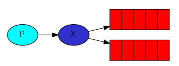

# Publish/ Subscribe
Rabbitmq includes some important message model such as :
- A producer is a user application that send message
- A exchange is a very simple thing. On one side it receives message from producers and the other side it pushes them to queues. There are few exchange types available: direct, topic, fanout and headers.
- A queue is a buffer that store messages.
- A consumer is user application that receive messages.

### 1. Create Queue
- creating a non-durable queue. if we provide queue name as string empty, we will create a non-durable queue with a generated name.
- if you want to detete that queue after closing, we will declared it as "exclusive"

channel.assertQueue('', {exclusive: true});

  
### 2. Bindings 
we need to tell the exchange send messages to our queue. The relationship between exchange and a queue is called a binding.

channel.bindQueue(queue_name, exchange_name, route_key);
### because our exchange' type is fanout so  route_key is an empty string.

# Algorithm
### 1. Publish
  - 1.1 create connection to rabbitmq server 
  - 1.2 create a channel
  - 1.3 declare exchange with name "logs", "fanout" type and feature "durable: false" as we only interested currently logs 
  - 1.4 push message to the exchange with an empty routing key

### 2. subscribe
  - 2.1 create connection to rabbitmq server 
  - 2.2 create a channel
  - 2.3 declare exchange with the same argument with exchange in pubisher as name, type,feature
  - 2.4 declare a non-durable queue
  - 2.5 tell rabbitmq not give more than one message to queue at a time "channel.prefetch(1)"
  - 2.6 declare consumer to receive messages
  - 2.7 message acknowledgment after proceesing completed 