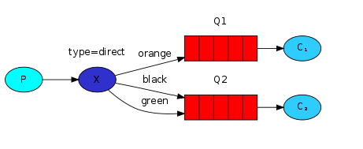
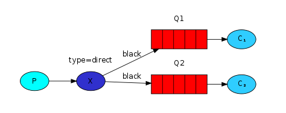

# Routing
### 1. Direct exchange
Messages go to the queues whose "routing key" exactly matches the "routing key" of the message.

### 2. multiple binding
It is perfectly legal to bind multiple queues with the same binding key.

# The algorithm
### 1. Emit direct
 - 1.1 create connection
 - 1.2 create channel
 - 1.3 declare direct exchange with name and  non-durable option
 - 1.4 push message with exchange name, routing key, buffer message

### 2. Listen log 
 - 2.1 create connection
 - 2.2 create channel
 - 2.3 declare direct exchange with name and non-durable option
 - 2.4 declare non-durable queue with arguments: an empty name, exclusive option
 - 2.5 binding queue with exchange by name queue, exhange name, routing key
 - 2.6 get messages
 - 2.7 message acknowledgment when completed
