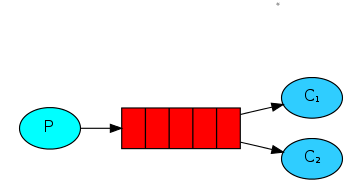
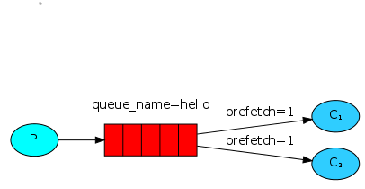

# RabbitMQ Tutorial

### Work Queue
#### 1. The diagram
The main idea behind work queue is to avoid doing a resource-intensive task immediately and having to wait for it to complete.

#### 2. Round-bin dispatching 
RabbitMQ will send each message to the next consumer in squence. this way of distributing messages is called roun-bin 

#### 3. Message Acknowledgment
In order to make sure a message never lost. RabbitMQ support a message acknowledgment(noAck). An ack send back by the consumer tell RabbitMQ that a particular message have been recieved, processed and that RabbitMQ is free to delete it 

#### 4. Message durability 
Message durability make sure that the queue will survive a RabbiMQ node restart.
To do that you need to apply 
- "durable" option to both the producer and consumer code.

channel.assertQueue("task_Queue",{durable:true})

- "presistent" option "channel.sendToQueue" takes:

channel.sendToQueue(queue, Buffer.from(msg), {persistent: true});

#### 5. Fair dispatch
You might have noticed that the dispatching still doesn't work exactly as we want. For example in a situation with two workers, when all odd messages are heavy and even messages are light, one worker will be constantly busy and the other one will do hardly any work. Well, RabbitMQ doesn't know anything about that and will still dispatch messages evenly.

This happens because RabbitMQ just dispatches a message when the message enters the queue. It doesn't look at the number of unacknowledged messages for a consumer. It just blindly dispatches every n-th message to the n-th consumer.

In order to defeat that we can use the prefetch method with the value of 1. This tells RabbitMQ not to give more than one message to a worker at a time. Or, in other words, don't dispatch a new message to a worker until it has processed and acknowledged the previous one. Instead, it will dispatch it to the next worker that is not still busy.

channel.prefetch(1);

#### 6. Result 

